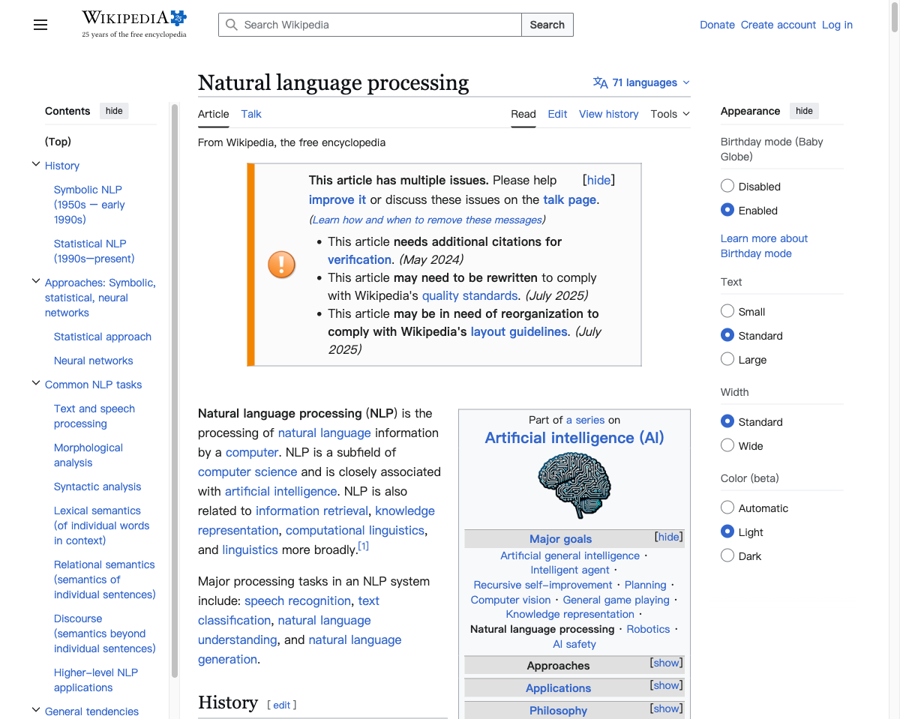

# NotOnlyTranslator

**智能英语阅读助手 - 只翻译你不会的词**

[](https://chromewebstore.google.com/)
[](https://opensource.org/licenses/MIT)

---

## 为什么选择 NotOnlyTranslator？

**问题**：传统翻译工具翻译所有内容，让你失去学习机会。

**解决方案**：NotOnlyTranslator 只翻译超出你水平的词汇，帮助你在阅读中自然学习。

| 传统翻译工具 | NotOnlyTranslator |
|-------------|-------------------|
| 翻译所有内容 ❌ | 只翻译你不会的词 ✅ |
| 依赖翻译，无法进步 ❌ | 循序渐进，持续提升 ✅ |
| 千篇一律 ❌ | 个性化定制 ✅ |

---

## 🎬 演示



*看一眼就懂：访问英文网站 → 自动高亮难词 → 点击查看翻译 → 标记学习*

---

## ✨ 核心功能

### 🎯 智能翻译
- **自适应水平**：根据你的英语水平（四六级/托福/雅思/GRE）智能判断
- **精准高亮**：只高亮你不会的词，保持阅读流畅
- **上下文翻译**：基于句子语境，翻译更准确

### 📊 个性化学习
- **水平评估**：考试分数或 2 分钟快速测评
- **动态调整**：随着你标记词汇，系统自动优化
- **掌握度追踪**：可视化你的学习进度

### 📚 词汇管理
- **生词本**：一键收藏，带上下文保存
- **闪卡复习**：间隔重复，高效记忆
- **词汇推荐**：基于水平推荐新词学习

### 🔧 灵活配置
- **多 API 支持**：OpenAI、Anthropic、DeepL、有道翻译
- **本地模型**：支持 Ollama、LM Studio
- **界面定制**：高亮颜色、字体大小、翻译模式

---

## 🚀 快速开始

### 安装（二选一）

**方式一：Chrome 应用商店**（推荐）
> 即将上架，敬请期待

**方式二：从源码安装**
```bash
# 克隆仓库
git clone https://github.com/hungrywu/notOnlyTranslator.git
cd notOnlyTranslator

# 安装依赖并构建
npm install && npm run build

# 在 Chrome 中加载
# 1. 打开 chrome://extensions/
# 2. 启用"开发者模式"
# 3. 点击"加载已解压的扩展程序"
# 4. 选择 dist 文件夹
```

### 配置（2 分钟）

1. **设置 API 密钥**
   - 点击插件图标 → API 设置
   - 选择提供商（OpenAI/Anthropic/有道等）
   - 输入 API 密钥

2. **设置英语水平**
   - 选择考试类型和分数
   - 或完成 20 题快速测评

3. **开始阅读**
   - 访问任何英文网站
   - 自动高亮难词，点击查看翻译

---

## 💡 使用场景

| 场景 | 如何帮助 |
|------|----------|
| 📖 阅读英文文章 | 只翻译生词，保持阅读流畅 |
| 📝 学术论文阅读 | 专业术语精准翻译 |
| 💼 工作文档 | 快速理解，提升效率 |
| 🎬 字幕学习 | 配合视频内容学习 |

---

## 📈 用户评价

> "用了两周，阅读速度提升明显，不再依赖全页翻译了。"
> — 四六级备考用户

> "终于找到一个不会过度翻译的工具，完美符合我的需求。"
> — 托福 105 分用户

> "闪卡复习功能太棒了，每天 10 分钟巩固生词。"
> — 职场英语学习者

---

## 🛠️ 技术栈

<details>
<summary>点击展开技术详情</summary>

- **前端框架**: React 18 + TypeScript
- **构建工具**: Vite + @crxjs/vite-plugin
- **样式**: Tailwind CSS
- **状态管理**: Zustand
- **存储**: Chrome Storage API
- **翻译服务**: OpenAI / Anthropic / DeepL / 有道

</details>

---

## 🤝 贡献

欢迎贡献代码、报告问题或提出建议！

1. Fork 本仓库
2. 创建特性分支 (`git checkout -b feature/AmazingFeature`)
3. 提交更改 (`git commit -m 'feat: 添加某某功能'`)
4. 推送到分支 (`git push origin feature/AmazingFeature`)
5. 创建 Pull Request

---

## 📄 许可证

本项目采用 MIT 许可证 - 详见 [LICENSE](LICENSE) 文件。

---

## 🙏 致谢

- 翻译服务：OpenAI GPT-4o-mini、Anthropic Claude、DeepL、有道翻译
- 构建工具：React、Vite、Tailwind CSS
- 灵感来源：语言学习与间隔重复理论

---

**[⬆ 返回顶部](#notonlytranslator)**

---

## English Version

**Smart English Reading Assistant - Only Translate What You Don't Know**

### Why NotOnlyTranslator?

**Problem**: Traditional translators translate everything, causing you to lose learning opportunities.

**Solution**: NotOnlyTranslator only translates words beyond your level, helping you learn naturally while reading.

### Key Features

- **Adaptive Translation**: Based on your proficiency level (CET-4/6, TOEFL, IELTS, GRE)
- **Smart Highlighting**: Only highlights words you don't know
- **Context-Aware Translation**: More accurate translations based on sentence context
- **Personalized Learning**: Dynamic adjustment as you mark words
- **Vocabulary Management**: Save unknown words with context
- **Flashcard Review**: Spaced repetition for efficient learning
- **Multiple API Support**: OpenAI, Anthropic, DeepL, Youdao, local models

### Quick Start

1. Install from Chrome Web Store (coming soon) or build from source
2. Set your API key (OpenAI/Anthropic/Youdao)
3. Set your English level (exam score or quick test)
4. Start reading any English website

### Tech Stack

React 18 + TypeScript + Vite + Tailwind CSS + Zustand + Chrome Storage API

---

**Made with ❤️ for English learners**