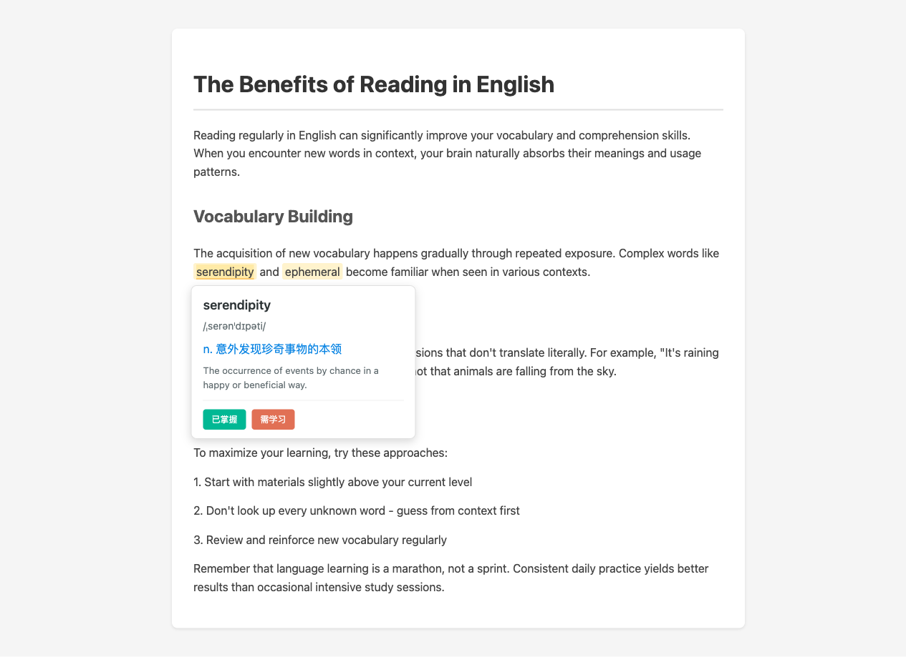

# NotOnlyTranslator

**智能英语阅读助手 - 只翻译你不会的词**

[](LICENSE)

一个面向英语学习者的 Chrome / Edge 扩展：根据阅读水平和已标记词汇突出难词，在保留英文阅读体验的同时提供中文释义。可切换行内、双语对照和全文翻译；支持流式响应的服务会在每段结果完整到达后立即展示，不必等整批结束。

**常用单词优先查内置词典；未命中或需要语境翻译时才使用所选服务。**

> 可从 [GitHub Releases](https://github.com/davisjiahao/notOnlyTranslator/releases) 下载安装包，或从源码构建；尚未提供 Chrome 应用商店下载。词典命中不代表网页阅读完全离线，云端翻译会发送相应文本到所选服务。

---

## 界面预览



*示意图，不代表对任意网站的实际识别结果。阅读流程：打开英文页面 → 高亮候选难词 → 点击查看释义 → 标记已知或生词。*

---

## 功能与边界

| 功能 | 当前实现 |
| --- | --- |
| 分级阅读 | 按考试分数或测评估算词汇水平，结合已知／生词标记筛选和高亮候选词；自动判断不保证覆盖每个陌生词。 |
| 释义与翻译 | 内置词典、本地缓存、所选翻译服务；提供行内、双语及全文模式，可按设置补充短语和语法说明。 |
| 逐段显示与复用 | 支持 SSE 的批次按完整段落提前显示；仅切换展示模式时复用已有结果；页面刷新可复用有效缓存或仍在运行的后台批次。 |
| 学习记录 | 生词筛选、闪卡复习、掌握度和翻译历史；评分确认前可撤销，保存失败可重试。统计展示当前词条快照与已有时间记录，不推算缺失的学习历史。 |
| 界面与无障碍 | 阅读优先弹窗、分组设置与窄屏导航；高亮和浮层支持键盘操作及焦点返回，支持明暗主题和系统减少动画偏好。 |
| 服务配置 | 支持云端提供商与 OpenAI 兼容服务，也可连接本机 Ollama。云端请求可能计费；请自行保管 API 密钥。 |

**隐私提示：**词典与用户记录存于扩展本地／浏览器同步存储。默认配置未填写密钥时，不会自动把页面文本交给 Google 翻译；本地词典无法处理的内容会提示配置服务。明确选择云端或其他联网翻译（包括无需密钥的 Google 翻译）后，相应文本会发送到服务方。备份可能包含 API 密钥，勿公开分享，也不要在敏感页面启用联网翻译。导入设置可能改变翻译服务和联网范围，请导入后检查提供商与模式。为防止备份将页面文本送往未知地址，备份中的自定义服务端点（含本机地址）不会导入；如需使用，请在设置页自行重新配置。

---

## 快速开始

### 从发布包安装

1. 从 [GitHub Releases](https://github.com/davisjiahao/notOnlyTranslator/releases) 下载 `notOnlyTranslator-v*.zip` 并解压到固定目录。
2. 打开 `chrome://extensions/`（Edge 为 `edge://extensions/`），开启**开发者模式**。
3. 点击**加载已解压的扩展程序**，选择解压后包含 `manifest.json` 的目录。

### 从源码安装

需要 Node.js **20.19.0 或更新版本**（建议使用仍在维护的 LTS 版本）、npm，以及 Chrome 或 Edge。

```bash
# 克隆仓库
git clone https://github.com/davisjiahao/notOnlyTranslator.git
cd notOnlyTranslator

# 安装依赖并构建
npm install
npm run build
```

1. 打开 `chrome://extensions/`；Edge 使用 `edge://extensions/`。
2. 开启**开发者模式**，点击**加载已解压的扩展程序**，选择生成的 `dist` 文件夹。
3. 将扩展固定到工具栏，便于打开设置和切换阅读方式。

**更新已有安装：**更新源码后重新运行 `npm run build`，在扩展管理页点击**重新加载**，再刷新已经打开的阅读页面。仅替换磁盘文件不会自动让现有页面使用新版本。

### 首次配置（约 2 分钟）

1. **选择翻译方式**
   - 基础单词查询优先使用本地词典，命中时无需 API 密钥或网络
   - 需要模型增强时，点击插件图标 → API 设置，选择提供商并配置连接
   - 云端服务按提供商要求输入 API 密钥；本机 Ollama 可留空

2. **设置英语水平**
   - 选择考试类型和分数
   - 或完成 20 题快速测评

3. **开始阅读**
   - 访问英文网站，自动高亮难词，点击查看翻译
   - 四个阅读操作保留默认快捷键；打开弹窗可点击扩展图标，也可在 `chrome://extensions/shortcuts` 自行绑定快捷键

---

## 选择阅读模式

| 模式 | 阅读效果 |
| --- | --- |
| 行内 | 保留英文，在识别出的难词后直接展示中文释义，适合连续阅读。 |
| 双语对照 | 保留英文段落，在其下方展示完整中文译文，便于逐段核对。 |
| 全文翻译 | 以中文译文为主，同时保留难词的英文原词，兼顾理解和词汇学习。 |

仅切换展示模式时，已完成段落使用已有结果在本地重新排版，不因切换展示方式再次请求翻译。翻译过程中切换模式，后续结果按当前模式展示。更换服务、调整翻译任务设置或网页正文变化，可能需要重新翻译。

如果已有结果只有词义、没有完整段落译文，双语和全文模式会保留原文及已有释义，并提示暂无全文；仅切换展示模式不会自动补发全文翻译请求。

### 逐段流式展示与刷新

- **按批请求，按段显示。**一批可以包含多个段落；每段的全文、词义和已启用的语法分析完整到达并通过校验后立即展示，不等待整批结束，也不逐字刷新半截 JSON。
- **服务必须真正返回流式内容。**目前支持 OpenAI 兼容接口（含使用该接口的 Ollama）、Anthropic 和 Gemini 的 SSE 响应。服务忽略流式参数、只返回普通 JSON 时，仍兼容完整响应，但无法提前展示；百度原生接口保留普通 JSON 路径。
- **刷新优先复用。**有效缓存可以直接使用；同一翻译任务仍在后台运行时，新页面可加入该任务，重放已完成段落并继续接收后续结果，不重复发出相同请求。
- **复用有边界。**正文、服务或影响结果的配置变化，缓存过期／被清理，或浏览器重启、后台 Service Worker 被回收，都可能需要重新请求。刷新不会主动取消后台批次；主动停用翻译或使请求失效的配置变更仍会取消相关任务。

---

## 本地优先与 Ollama

- **基础查询**：优先复用匹配语境的生词本释义与缓存，再查询随扩展提供的 17,404 条常用及考试词条。包含常见屈折变化；词典返回通用义项，不保证消除一词多义。
- **自动筛词**：个人已知/未知词和 CEFR 在本地参与筛选。轻量词汇模式由本地确定候选词、难度及位置，模型只补充中文释义；短语、语法和全文翻译仍使用对应增强流程。
- **离线边界**：单词查词命中本地词典时可不调用翻译 API；段落仅在行内模式、关闭短语／语法增强且所有候选词均有本地释义时可免 API 请求。默认开启短语与语法增强；未配置密钥时不会自动回退 Google，未命中后可能提示配置服务。明确选择 Google 翻译需要联网：其全文译文可用于双语／全文模式；仅行内模式不支持需要联网的段落，会在发送前提示切换模式。云端增强会将对应文本发送给所选服务。

### 配置本机 Ollama

1. 启动 Ollama，在扩展 API 设置中选择 **Ollama 本地模型**。
2. 默认地址可留空（使用 `http://localhost:11434/v1/chat/completions`）；若填写自定义地址，必须填**完整聊天端点**，不会自动补路径。本机默认服务无需 API 密钥。
3. 选择已安装的模型并测试连接。CPU 机器可从 `qwen3:4b` 开始实测速度和效果；基础查词不需要安装模型。

翻译调用走 OpenAI 兼容接口，请求会尝试关闭思考并在适用时要求 JSON 输出，实际支持程度取决于模型。Ollama **单次翻译请求**默认限时 90 秒，后台翻译消息整体预算 120 秒；连接测试不受前述单次翻译超时约束。主动停用翻译或更换影响请求的配置时会取消相关任务；仅切换展示模式则复用已有结果。

### 离线词典来源与更新

词条来自 [ECDICT](https://github.com/skywind3000/ECDICT)，筛选 BNC/词频前 15,000 或 CET4/CET6/高考/考研标签且含中文释义的英文词。许可证保留于 [`src/data/ECDICT-LICENSE`](src/data/ECDICT-LICENSE)，构建产物也携带 `ECDICT-LICENSE`。

日常 `npm run build` 使用仓库内的 JSON，无需下载原始词典。仅在维护词库时运行以下命令（已在 Node 25 验证；使用现有环境代理）：

```bash
node --use-env-proxy scripts/buildOfflineDictionary.ts
```

生成器保存来源、筛选规则、源文件及产物 SHA-256。若上游内容与已记录哈希不同，会拒绝静默覆盖；更新前须审查来源与许可证变化。

---

## 适用范围

适合阅读普通英文网页时辅助理解词汇；专业术语、语境多义词和复杂页面布局需自行核对结果。页面编辑区、表单和部分导航内容会被跳过，以减少误翻译及将输入内容送出页面的风险。

---

## 开发与验证

```bash
npm test             # 单元与集成测试
npm run lint         # ESLint
npm run type-check   # TypeScript
npm run build        # 构建扩展
# 统计 src 下全部 TS/TSX 文件的覆盖率
npx vitest run --coverage --coverage.include='src/**/*.{ts,tsx}'
```

端到端测试需事先安装 Playwright 浏览器：

```bash
npx playwright install chromium

# 本地优先阅读的隔离用例，不调用付费模型服务
npx playwright test --config=e2e/local-first.config.ts

# 流式显示、刷新复用、模式切换及翻译展示的定向回归
npx playwright test --config=e2e/local-first.config.ts \
  batch-streaming.spec.ts mode-switching.spec.ts \
  llm-translation-display.spec.ts github-like-reading.spec.ts
```

隔离测试使用真实扩展链路与受控 HTTP 响应，核对段落可见性、刷新后的文档身份和后台请求次数；不能替代真实提供商、个人浏览器配置及任意网站的验收。`npm run test:e2e` 使用另一套默认配置，可能访问外部网站，运行前请核对配置。

---

## 技术栈

<details>
<summary>点击展开技术详情</summary>

- **前端框架**: React 18 + TypeScript
- **构建工具**: Vite + @crxjs/vite-plugin
- **样式**: Tailwind CSS
- **状态管理**: Zustand
- **存储**: Chrome Storage API
- **翻译服务**: OpenAI / Anthropic / DeepL / 有道

</details>

---

## 🤝 贡献

欢迎贡献代码、报告问题或提出建议！

1. Fork 本仓库
2. 创建特性分支 (`git checkout -b feature/AmazingFeature`)
3. 提交更改 (`git commit -m 'feat: 添加某某功能'`)
4. 推送到分支 (`git push origin feature/AmazingFeature`)
5. 创建 Pull Request

---

## 📄 许可证

本项目采用 MIT 许可证 - 详见 [LICENSE](LICENSE) 文件。

---

## 🙏 致谢

- 翻译服务：OpenAI GPT-4o-mini、Anthropic Claude、DeepL、有道翻译
- 构建工具：React、Vite、Tailwind CSS
- 灵感来源：语言学习与间隔重复理论

---

**[⬆ 返回顶部](#notonlytranslator)**

---

## English Version

**Smart English Reading Assistant - Only Translate What You Don't Know**

### Why NotOnlyTranslator?

**Problem**: Traditional translators translate everything, causing you to lose learning opportunities.

**Solution**: NotOnlyTranslator only translates words beyond your level, helping you learn naturally while reading.

### Key Features

- **Adaptive Translation**: Based on your proficiency level (CET-4/6, TOEFL, IELTS, GRE)
- **Selective Highlighting**: Highlights candidate difficult words using your level and known/unknown word marks
- **Local-first Lookup**: Uses bundled dictionary entries and cached meanings before a translation service where applicable
- **Translation Modes**: Inline meanings, bilingual paragraphs, and full translation with difficult English words retained; display-only changes reuse existing results
- **Progressive Paragraphs**: A complete paragraph appears as soon as it arrives over SSE, without waiting for the rest of the batch; JSON-only responses still wait for completion
- **Refresh Reuse**: Reuses valid cache entries or joins an active background batch; worker restarts, cache expiry, and relevant configuration changes may require a new request
- **Learning Tools**: Filtered vocabulary, flashcard review with undo before confirmation and retry after failed saves, current mastery snapshots, and recorded activity without invented historical trends
- **Accessible Interface**: Reading-first popup, grouped responsive settings, keyboard-operated highlights with focus return, light/dark themes, and reduced-motion support
- **Provider Options**: Cloud services and local Ollama; cloud requests may incur charges

### Quick Start

1. Download and extract the ZIP from [GitHub Releases](https://github.com/davisjiahao/notOnlyTranslator/releases), then load the folder containing `manifest.json` as an unpacked Chrome/Edge extension. Alternatively, clone the repository, run `npm install && npm run build`, and load `dist`.
2. Set your English level; configure a provider if you need context-aware translation (local Ollama needs no API key by default)
3. Read an English page and mark known or unknown words; offline lookup only works when local data covers the request

If a cached result contains only word meanings, bilingual and full-translation modes keep the original text and indicate that a full translation is unavailable. Switching display modes alone does not request the missing full translation.

After updating the source, rebuild, reload the extension on its management page, and refresh existing reading tabs. Replacing build files alone does not update content scripts already loaded in a page.

Cloud translation sends the relevant text to the selected provider. Do not enable it on sensitive pages or share backups containing credentials. SSE support depends on the provider; isolated tests do not certify your live provider or every website.

### Tech Stack

React 18 + TypeScript + Vite + Tailwind CSS + Zustand + Chrome Storage API

---

**Made with ❤️ for English learners**