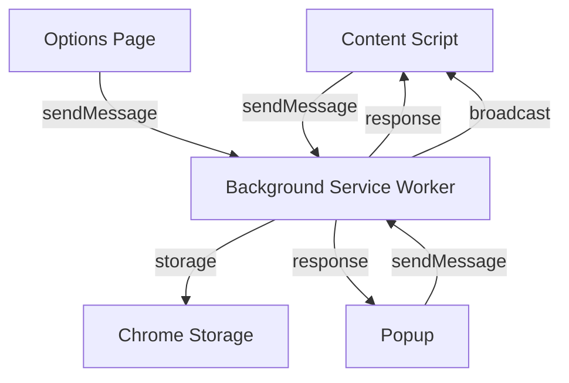
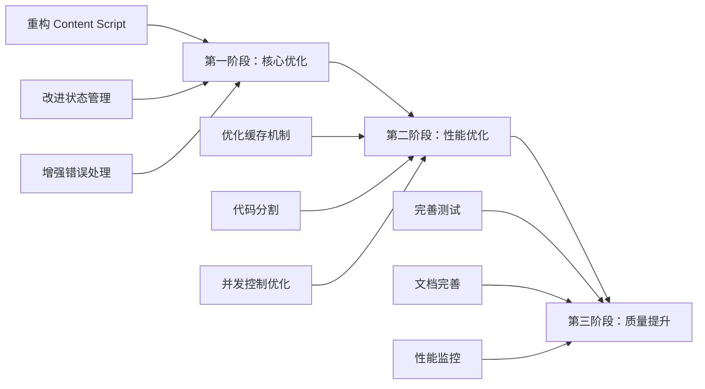

# NotOnlyTranslator 项目架构分析报告

## 执行摘要

本报告对 NotOnlyTranslator 浏览器扩展项目进行了全面的架构分析。该项目采用 TypeScript + Vite + React 技术栈，实现了基于用户英语水平的智能翻译功能。整体架构设计合理，但在某些方面存在优化空间。

---

## 1. 项目结构分析

### 1.1 当前目录结构

```
src/
├── background/          # 后台服务脚本
│   ├── index.ts         # 主入口和消息处理
│   ├── translation.ts   # 翻译服务
│   ├── translationApi.ts # API 调用服务
│   ├── batchTranslation.ts # 批量翻译服务
│   ├── enhancedCache.ts # 增强缓存管理
│   ├── storage.ts       # 存储管理
│   ├── frequencyManager.ts # 词频管理
│   └── userLevel.ts     # 用户等级管理
├── content/             # 内容脚本
│   ├── index.ts         # 主入口
│   ├── batchTranslationManager.ts # 批量翻译管理
│   ├── viewportObserver.ts # 视口观察器
│   ├── translationDisplay.ts # 翻译显示
│   ├── highlighter.ts   # 高亮器
│   ├── tooltip.ts       # 工具提示
│   ├── marker.ts        # 标记服务
│   ├── floatingButton.ts # 浮动按钮
│   └── styles.css       # 样式
├── popup/               # 弹出窗口
│   ├── App.tsx
│   ├── components/
│   └── styles.css
├── options/             # 选项页面
│   ├── App.tsx
│   ├── components/
│   └── styles.css
├── shared/              # 共享模块
│   ├── types/           # 类型定义
│   ├── constants/       # 常量定义
│   ├── hooks/           # React Hooks
│   ├── utils/           # 工具函数
│   └── services/        # 共享服务
└── data/                # 数据文件
    └── vocabulary/      # 词汇表数据
```

### 1.2 优点

1. **模块化设计清晰**：按照浏览器扩展的标准架构划分（background、content、popup、options），职责分离明确
2. **共享层设计合理**：`shared/` 目录集中管理类型、常量、工具函数，避免代码重复
3. **功能内聚性好**：每个模块内部进一步按功能细分（如 `background/` 中的翻译、缓存、存储等）
4. **类型定义集中**：所有 TypeScript 类型定义在 `src/shared/types/index.ts` 中统一管理

### 1.3 存在的问题

1. **content 脚本过于臃肿**：[`index.ts`](src/content/index.ts:1) 文件达到 1430 行，包含过多职责（事件处理、批量翻译初始化、模式切换等）
2. **缺少服务层抽象**：部分业务逻辑直接写在组件中（如 [`popup/App.tsx`](src/popup/App.tsx:15) 和 [`options/App.tsx`](src/options/App.tsx:61)）
3. **工具函数文件过大**：[`utils/index.ts`](src/shared/utils/index.ts:1) 达到 387 行，建议按功能拆分
4. **常量定义分散**：部分常量在 types 文件中定义，部分在 constants 文件中定义

---

## 2. 技术栈和依赖分析

### 2.1 当前技术栈

| 类别 | 技术 | 版本 |
|------|------|------|
| 核心框架 | React | 18.2.0 |
| 构建工具 | Vite | 5.0.8 |
| 语言 | TypeScript | 5.3.3 |
| 状态管理 | Zustand | 4.4.7 |
| 扩展支持 | webextension-polyfill | 0.10.0 |
| 构建插件 | @crxjs/vite-plugin | 2.0.0-beta.23 |
| 样式 | Tailwind CSS | 3.3.6 |
| 图表 | Recharts | 3.7.0 |
| 测试 | Vitest + Playwright | 4.0.18 + 1.58.0 |

### 2.2 优点

1. **技术选型现代**：采用 Vite 作为构建工具，开发体验好，构建速度快
2. **状态管理轻量**：使用 Zustand 而非 Redux，代码简洁
3. **类型安全**：全面使用 TypeScript，提供完整的类型定义
4. **测试覆盖**：同时配置了单元测试（Vitest）和 E2E 测试（Playwright）

### 2.3 存在的问题

1. **依赖版本不一致**：
   - `@vitest/coverage-v8` 和 `vitest` 版本为 4.0.18，但 Vitest 目前最新稳定版为 1.x
   - `@playwright/test` 版本为 1.58.0，需确认是否与 Playwright MCP 工具兼容
2. **潜在的依赖冲突**：同时存在 `package-lock.json` 和 `pnpm-lock.yaml`，表明项目可能在 npm 和 pnpm 之间切换
3. **缺少代码质量工具**：
   - 无 Prettier 配置
   - 无 Husky 预提交钩子
   - 无 Commitlint 提交规范

### 2.4 构建配置分析

[`vite.config.ts`](vite.config.ts:1) 分析：

```typescript
// 存在的问题
1. 自定义插件 copyContentCss 用于复制 CSS 文件，这表明构建配置可能存在冗余
2. 缺少源码映射配置，不利于调试
3. 缺少代码分割优化配置
```

---

## 3. 扩展架构分析

### 3.1 模块通信机制



### 3.2 消息类型定义

消息类型在 [`src/shared/types/index.ts`](src/shared/types/index.ts:171) 中统一定义：

```typescript
export type MessageType =
  | 'TRANSLATE_TEXT'
  | 'BATCH_TRANSLATE_TEXT'
  | 'MARK_WORD_KNOWN'
  | 'MARK_WORD_UNKNOWN'
  | 'GET_USER_PROFILE'
  | 'UPDATE_USER_PROFILE'
  | 'GET_SETTINGS'
  | 'UPDATE_SETTINGS'
  // ... 等
```

### 3.3 优点

1. **消息类型集中管理**：所有消息类型在 types 文件中统一定义
2. **响应格式统一**：使用 `MessageResponse<T>` 统一响应格式
3. **广播机制**：设置更新时能通知所有标签页的 content script

### 3.4 存在的问题

1. **消息处理缺乏类型安全**：[`handleMessage`](src/background/index.ts:140) 函数中的类型转换使用了 `as` 断言，存在类型安全风险
2. **缺少消息验证**：未对接收到的消息 payload 进行验证
3. **错误处理不统一**：部分消息处理有 try-catch，部分没有
4. **状态同步问题**：popup 和 options 页面的状态更新依赖于手动刷新，缺少实时同步机制

### 3.5 状态管理分析

[`useStore.ts`](src/shared/hooks/useStore.ts:1) 使用 Zustand 进行状态管理：

**优点**：
- 简洁的 API
- 支持持久化到 Chrome Storage

**问题**：
- 状态更新后直接调用 `persistToStorage()`，可能导致频繁的存储写入
- 缺少中间件模式，无法进行状态变更日志记录
- 未使用 Zustand 的 persist 中间件，而是手动实现持久化

---

## 4. 性能架构分析

### 4.1 批量翻译机制

[`batchTranslation.ts`](src/background/batchTranslation.ts:1) 实现了批量翻译服务：

**优点**：
1. **段落合并**：将多个段落合并为单次 API 调用，减少请求次数
2. **缓存优化**：支持段落级缓存，基于文本内容哈希
3. **智能过滤**：自动跳过中文占比过高的段落和简单段落
4. **重试机制**：使用指数退避策略进行重试

**配置参数**（[`src/shared/constants/index.ts`](src/shared/constants/index.ts:198)）：
```typescript
export const DEFAULT_BATCH_CONFIG = {
  maxParagraphsPerBatch: 15,  // 单批最大段落数
  maxCharsPerBatch: 10000,    // 单批最大字符数
  debounceDelay: 300,         // 防抖延迟
  maxCacheEntries: 500,       // 缓存最大条目数
  cacheExpireTime: 7 * 24 * 60 * 60 * 1000, // 7 天过期
};
```

**问题**：
1. **并发控制不足**：[`BatchTranslationManager`](src/content/batchTranslationManager.ts:40) 虽然设置了 `MAX_CONCURRENT_BATCHES = 3`，但缺少全局请求队列管理
2. **内存泄漏风险**：`processingParagraphIds` 使用 Set 存储，但未清理已完成的条目（只在失败时清理）
3. **缓存淘汰策略**：LRU 淘汰在达到 95% 容量时触发，但淘汰 10% 可能导致频繁的淘汰循环

### 4.2 视口观察器实现

[`viewportObserver.ts`](src/content/viewportObserver.ts:1) 使用 IntersectionObserver 检测可视区域：

**优点**：
1. **性能优化**：使用 IntersectionObserver 而非 scroll 事件监听
2. **防抖处理**：回调函数使用防抖处理，避免频繁触发
3. **提前加载**：rootMargin 设为 800px，提前加载即将进入视口的内容

**问题**：
1. **内存管理**：`observedElements` 使用 Set 存储所有观察元素，但未提供自动清理机制
2. **ID 生成策略**：使用计数器生成 ID，页面滚动时间长可能导致 ID 溢出
3. **路径生成复杂**：[`getElementPath`](src/content/viewportObserver.ts:159) 生成的 DOM 路径在动态页面中可能失效

### 4.3 翻译 API 管理

[`translationApi.ts`](src/background/translationApi.ts:1) 统一管理多种 API 供应商：

**支持的供应商**：
- 国外：OpenAI、Anthropic、Gemini、Groq
- 国内：DeepSeek、智谱、阿里通义、百度文心
- 本地：Ollama

**优点**：
1. **统一接口**：通过 `TranslationApiService.call()` 统一调用不同供应商的 API
2. **重试机制**：使用指数退避和随机抖动
3. **错误分类**：区分可重试和不可重试的错误
4. **Token 缓存**：百度 access token 有缓存机制

**问题**：
1. **全局状态**：`baiduTokenCache` 使用模块级变量，service worker 重启后丢失
2. **错误处理**：部分 API 调用未统一使用 `fetchWithApiError` 工具函数
3. **缺少限流**：未实现 API 请求限流机制

### 4.4 增强缓存机制

[`enhancedCache.ts`](src/background/enhancedCache.ts:1) 实现了段落级缓存：

**优点**：
1. **LRU 淘汰**：基于最后访问时间进行淘汰
2. **批量操作**：支持批量查询和设置缓存
3. **异步持久化**：使用防抖避免频繁写入存储
4. **版本管理**：支持缓存版本迁移

**问题**：
1. **内存占用**：所有缓存条目同时存储在内存和 Chrome Storage 中
2. **哈希冲突**：使用 DJB2 哈希算法，虽然简单但冲突概率较高
3. **过期清理**：依赖访问时检查过期，缺少定时清理任务

---

## 5. 其他架构问题

### 5.1 代码质量问题

1. **大文件问题**：
   - `src/content/index.ts`: 1430 行
   - `src/background/translationApi.ts`: 630 行
   - `src/options/components/ApiSettings.tsx`: 33412 字节
   - `src/content/tooltip.ts`: 20684 字节

2. **重复代码**：
   - Popup 和 Options 页面都有类似的设置更新逻辑
   - 多种 API 调用模式存在代码重复

3. **魔法数字**：
   - 多处使用硬编码的数字（如延迟时间、阈值等）

### 5.2 测试覆盖问题

1. **单元测试不足**：`tests/unit/` 目录下只有 4 个测试文件
2. **缺少集成测试**：缺少模块间交互的测试
3. **E2E 测试覆盖不全**：部分关键功能缺少 E2E 测试

### 5.3 文档问题

1. **缺少 API 文档**：未使用 JSDoc 或 TSDoc 注释
2. **架构文档缺失**：无架构设计文档
3. **变更日志简单**：[`CHANGELOG.md`](CHANGELOG.md:1) 内容较少

---

## 6. 优化建议

### 6.1 高优先级优化

#### 1. 重构 Content Script 主文件

**问题**：`src/content/index.ts` 达到 1430 行，职责过多

**建议**：
- 将事件处理逻辑提取到独立的 `eventHandlers.ts` 模块
- 将初始化逻辑提取到 `initializer.ts` 模块
- 将模式切换逻辑提取到 `modeManager.ts` 模块

#### 2. 改进状态管理

**问题**：手动实现持久化，缺少状态同步

**建议**：
- 使用 Zustand 的 persist 中间件
- 实现跨组件状态同步机制
- 添加状态变更日志记录

#### 3. 优化缓存机制

**问题**：内存和存储双重占用，哈希算法简单

**建议**：
- 考虑使用 Web Crypto API 的 SHA-256 进行哈希计算
- 实现定时清理过期缓存的任务
- 优化内存使用，仅在需要时加载缓存条目

#### 4. 增强错误处理

**问题**：错误处理不统一，缺少全局错误边界

**建议**：
- 统一使用 `fetchWithApiError` 进行 fetch 调用
- 在 React 组件中添加错误边界
- 实现全局错误报告和日志收集

### 6.2 中优先级优化

#### 5. 代码分割和懒加载

**建议**：
- 在 `vite.config.ts` 中配置代码分割
- 对 options 页面的大型组件进行懒加载
- 对词汇表数据进行按需加载

#### 6. 改进构建配置

**建议**：
- 添加源码映射配置
- 配置 Prettier 和 Husky
- 添加 Commitlint 提交规范

#### 7. 优化批量翻译并发控制

**建议**：
- 实现全局请求队列
- 添加请求超时机制
- 优化并发数量动态调整

#### 8. 增强测试覆盖

**建议**：
- 为核心服务添加单元测试
- 添加模块间交互的集成测试
- 完善 E2E 测试场景

### 6.3 低优先级优化

#### 9. 文档完善

**建议**：
- 添加 JSDoc/TSDoc 注释
- 编写架构设计文档
- 完善 CHANGELOG

#### 10. 性能监控

**建议**：
- 添加性能指标收集
- 实现缓存命中率监控
- 添加 API 调用统计

---

## 7. 架构优化路线图



---

## 8. 总结

NotOnlyTranslator 项目整体架构设计合理，采用了现代化的技术栈和良好的模块化设计。主要优势包括：

- 清晰的模块划分
- 统一的消息通信机制
- 完善的批量翻译和缓存机制
- 多 API 供应商支持

需要改进的主要方面：

1. **代码组织**：大文件重构，提高可维护性
2. **状态管理**：改进持久化和同步机制
3. **性能优化**：缓存、并发、内存管理
4. **质量保障**：测试覆盖、文档、代码规范

通过实施上述优化建议，可以显著提升项目的可维护性、性能和用户体验。
