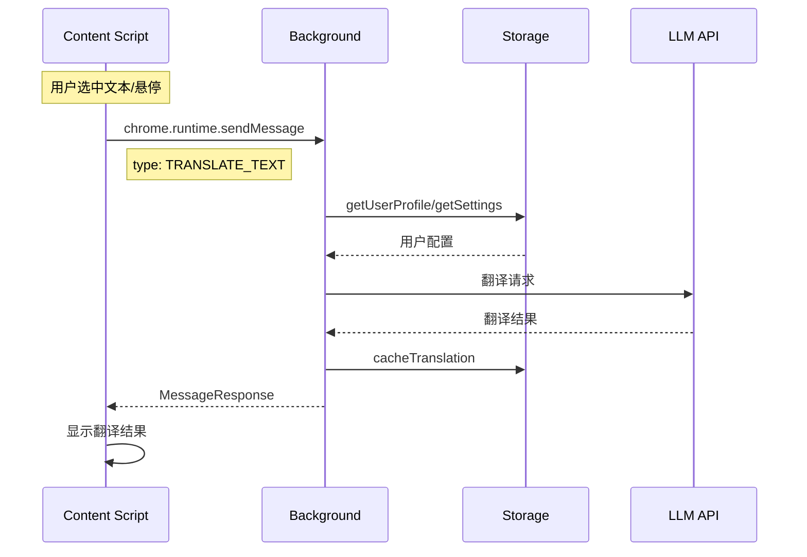

# notOnlyTranslator 项目架构分析报告

## 一、项目概述

**notOnlyTranslator** 是一个基于 Manifest V3 的浏览器扩展项目，旨在根据用户的英语水平智能翻译英文内容。项目采用 TypeScript + Vite + React 技术栈，支持多种 LLM API 提供商。

---

## 二、目录结构分析

### 2.1 当前目录结构

```
notOnlyTranslator/
├── src/
│   ├── background/          # Service Worker 后台脚本
│   ├── content/             # 内容脚本（页面注入）
│   ├── popup/               # 弹出窗口 UI
│   ├── options/             # 设置页面 UI
│   ├── shared/              # 共享模块
│   │   ├── constants/       # 常量定义
│   │   ├── hooks/           # React Hooks
│   │   ├── services/        # 共享服务
│   │   ├── types/           # TypeScript 类型定义
│   │   └── utils/           # 工具函数
│   └── data/                # 静态数据（词汇表）
├── public/                  # 静态资源
├── e2e/                     # E2E 测试
├── tests/                   # 单元测试
└── scripts/                 # 构建脚本
```

### 2.2 目录组织评估

#### ✅ 优点

1. **清晰的模块边界**：按照浏览器扩展的标准架构（background/content/popup/options）划分模块
2. **shared 模块设计合理**：将类型、常量、工具函数、服务抽象为共享模块
3. **测试目录独立**：单元测试和 E2E 测试分离，结构清晰
4. **数据目录独立**：词汇数据独立存放，便于维护和扩展

#### ⚠️ 存在的问题

1. **content 模块过于臃肿**：[`src/content/index.ts`](src/content/index.ts:1) 文件达到 1000+ 行，职责过多
2. **CSS 文件分散**：[`src/content/styles.css`](src/content/styles.css:1) 达 32KB，建议拆分
3. **components 目录层级不足**：popup 和 options 的组件目录缺少进一步分类

---

## 三、模块架构分析

### 3.1 模块依赖关系图

```mermaid
graph TB
    subgraph Background
        BG[index.ts]
        STORAGE[StorageManager]
        TRANS[TranslationService]
        BATCH[BatchTranslationService]
        API[TranslationApiService]
        CACHE[EnhancedCache]
        FREQ[FrequencyManager]
        USER[UserLevelManager]
    end

    subgraph Content
        CT[index.ts - NotOnlyTranslator]
        HL[Highlighter]
        TT[Tooltip]
        MS[MarkerService]
        TD[TranslationDisplay]
        VO[ViewportObserver]
        BM[BatchTranslationManager]
        FB[FloatingButton]
    end

    subgraph Popup
        PA[App.tsx]
        PC[Components]
    end

    subgraph Options
        OA[App.tsx]
        OC[Components]
    end

    subgraph Shared
        TYPES[types/index.ts]
        CONST[constants/index.ts]
        UTILS[utils/index.ts]
        HOOKS[hooks/useStore.ts]
    end

    %% Background 内部依赖
    BG --> STORAGE
    BG --> TRANS
    BG --> BATCH
    BG --> CACHE
    BG --> FREQ
    BATCH --> STORAGE
    BATCH --> CACHE
    BATCH --> API
    TRANS --> API

    %% Content 内部依赖
    CT --> HL
    CT --> TT
    CT --> MS
    CT --> TD
    CT --> VO
    CT --> BM
    CT --> FB

    %% Shared 依赖
    BG --> TYPES
    BG --> CONST
    BG --> UTILS
    CT --> TYPES
    CT --> CONST
    CT --> UTILS
    PA --> TYPES
    PA --> CONST
    OA --> TYPES
    OA --> CONST
    PA --> HOOKS
    OA --> HOOKS

    %% 跨模块通信
    CT -.->|chrome.runtime.sendMessage| BG
    PA -.->|chrome.runtime.sendMessage| BG
    OA -.->|chrome.runtime.sendMessage| BG
```



### 3.2 Background 模块分析

#### 核心职责

| 文件 | 职责 | 行数 |
|------|------|------|
| [`index.ts`](src/background/index.ts:1) | 消息路由、上下文菜单管理、服务初始化 | ~275 |
| [`storage.ts`](src/background/storage.ts:1) | Chrome Storage 封装 | ~284 |
| [`translationApi.ts`](src/background/translationApi.ts:1) | 多 API 提供商适配 | ~600+ |
| [`batchTranslation.ts`](src/background/batchTranslation.ts:1) | 批量翻译服务 | ~400+ |
| [`enhancedCache.ts`](src/background/enhancedCache.ts:1) | 增强缓存管理 | ~250+ |
| [`frequencyManager.ts`](src/background/frequencyManager.ts:1) | 词频管理 | ~200+ |
| [`userLevel.ts`](src/background/userLevel.ts:1) | 用户等级计算 | ~180 |

#### ✅ 优点

1. **服务类设计清晰**：采用静态类方法，便于测试和维护
2. **消息处理集中化**：[`handleMessage`](src/background/index.ts:140) 函数统一处理所有消息类型
3. **多 API 提供商支持完善**：支持 OpenAI、Anthropic、Gemini、DeepSeek 等 10+ 提供商
4. **重试机制健壮**：实现了带指数退避的 API 重试策略

#### ⚠️ 存在的问题

1. **消息类型分散**：消息处理逻辑在单一 switch 语句中，可考虑使用消息处理器映射
2. **StorageManager 职责过重**：同时处理 sync 和 local 存储，可拆分为两个管理器
3. **缺少依赖注入**：服务间依赖硬编码，不利于单元测试

### 3.3 Content 模块分析

#### 核心职责

| 文件 | 职责 | 行数 |
|------|------|------|
| [`index.ts`](src/content/index.ts:1) | 主控制器、事件处理、翻译协调 | ~1000+ |
| [`tooltip.ts`](src/content/tooltip.ts:1) | 悬浮提示框 | ~600+ |
| [`translationDisplay.ts`](src/content/translationDisplay.ts:1) | 翻译结果展示 | ~600+ |
| [`floatingButton.ts`](src/content/floatingButton.ts:1) | 浮动按钮 | ~350+ |
| [`highlighter.ts`](src/content/highlighter.ts:1) | 文本高亮 | ~180 |
| [`viewportObserver.ts`](src/content/viewportObserver.ts:1) | 视口观察 | ~200+ |
| [`batchTranslationManager.ts`](src/content/batchTranslationManager.ts:1) | 批量翻译管理 | ~200+ |

#### ✅ 优点

1. **功能模块化**：将高亮、提示框、翻译显示等功能拆分为独立类
2. **视口优化**：使用 [`ViewportObserver`](src/content/viewportObserver.ts:1) 实现懒加载
3. **批量翻译支持**：实现段落合并翻译，减少 API 调用

#### ⚠️ 存在的问题

1. **主文件过于庞大**：[`NotOnlyTranslator`](src/content/index.ts:21) 类职责过多（事件处理、翻译协调、导航管理、UI 更新）
2. **事件绑定过多**：存在大量事件监听器（mouseup、mousedown、mouseover、keydown 等）
3. **状态管理分散**：多个私有状态变量分散在类中，可考虑使用状态管理模式

### 3.4 Popup 和 Options 模块分析

#### Popup 模块

```typescript
// src/popup/App.tsx
export default function App() {
  const [profile, setProfile] = useState<UserProfile | null>(null);
  const [settings, setSettings] = useState<UserSettings | null>(null);
  // ... 直接使用 chrome.runtime.sendMessage 与 background 通信
}
```

#### Options 模块

```typescript
// src/options/App.tsx
export default function App() {
  const [profile, setProfile] = useState<UserProfile | null>(null);
  const [settings, setSettings] = useState<UserSettings>(DEFAULT_SETTINGS);
  // ... 同样直接使用 chrome.runtime.sendMessage
}
```

#### ✅ 优点

1. **组件拆分合理**：API 设置、通用设置、词汇设置等独立组件
2. **UI 设计现代**：使用 Tailwind CSS，界面美观
3. **表单验证完善**：API 测试功能完整

#### ⚠️ 存在的问题

1. **状态管理重复**：Popup 和 Options 都有相似的状态逻辑，未复用
2. **Zustand Store 未被实际使用**：[`useStore`](src/shared/hooks/useStore.ts:1) 定义了但未被组件采用
3. **通信逻辑耦合**：直接在组件中调用 `chrome.runtime.sendMessage`，未封装为服务层

---

## 四、通信机制分析

### 4.1 消息类型定义

```typescript
// src/shared/types/index.ts
export type MessageType =
  | 'TRANSLATE_TEXT'
  | 'BATCH_TRANSLATE_TEXT'
  | 'MARK_WORD_KNOWN'
  | 'MARK_WORD_UNKNOWN'
  | 'GET_USER_PROFILE'
  | 'UPDATE_USER_PROFILE'
  | 'GET_SETTINGS'
  | 'UPDATE_SETTINGS'
  | 'GET_VOCABULARY'
  | 'ADD_TO_VOCABULARY'
  | 'REMOVE_FROM_VOCABULARY'
  | 'SHOW_TRANSLATION'
  | 'WORD_MARKED'
  | 'ADDED_TO_VOCABULARY'
  | 'SETTINGS_UPDATED'
  | 'TOGGLE_ENABLED';
```

### 4.2 通信流程图



### 4.3 通信评估

#### ✅ 优点

1. **类型安全**：使用 TypeScript 定义消息类型和响应格式
2. **统一消息格式**：`Message<T>` 和 `MessageResponse<T>` 泛型设计
3. **错误处理完善**：消息处理有统一的 try-catch 和错误响应

#### ⚠️ 存在的问题

1. **缺少消息通信封装**：未提供类型安全的消息发送工具函数
2. **广播通知不优雅**：[`UPDATE_SETTINGS`](src/background/index.ts:230) 后遍历所有标签页通知

---

## 五、技术栈评估

### 5.1 构建配置

#### Vite 配置分析

```typescript
// vite.config.ts
export default defineConfig({
  plugins: [
    react(),
    crx({ manifest }),  // @crxjs/vite-plugin
    copyContentCss(),   // 自定义插件复制 CSS
  ],
  resolve: {
    alias: { '@': resolve(__dirname, 'src') },
  },
});
```

#### ✅ 优点

1. **使用 @crxjs/vite-plugin**：自动处理 Chrome 扩展的 HMR 和打包
2. **路径别名配置**：`@/` 别名简化导入
3. **自定义插件**：处理 content script CSS 复制问题

#### ⚠️ 存在的问题

1. **CSS 处理不完善**：需要自定义插件复制 content CSS，可能是 @crxjs 的限制
2. **未配置环境变量**：缺少开发/生产环境区分

### 5.2 TypeScript 配置

```json
{
  "compilerOptions": {
    "target": "ES2020",
    "module": "ESNext",
    "moduleResolution": "bundler",
    "strict": true,
    "noUnusedLocals": true,
    "noUnusedParameters": true,
    "baseUrl": ".",
    "paths": { "@/*": ["src/*"] }
  }
}
```

#### ✅ 优点

1. **严格模式开启**：`strict: true` 保证类型安全
2. **未使用变量检查**：`noUnusedLocals` 和 `noUnusedParameters`
3. **路径映射配置**：与 Vite 配置一致

#### ⚠️ 存在的问题

1. **缺少类型导出配置**：未设置 `declaration: true` 生成类型声明
2. **未配置项目引用**：可考虑为各模块配置独立的 tsconfig

### 5.3 依赖管理

#### 生产依赖

| 包名 | 版本 | 用途 |
|------|------|------|
| react | ^18.2.0 | UI 框架 |
| react-dom | ^18.2.0 | React DOM 渲染 |
| zustand | ^4.4.7 | 状态管理（未充分使用） |
| webextension-polyfill | ^0.10.0 | 浏览器扩展 API 兼容 |
| recharts | ^3.7.0 | 图表库 |

#### 开发依赖

| 包名 | 版本 | 用途 |
|------|------|------|
| vite | ^5.0.8 | 构建工具 |
| typescript | ^5.3.3 | TypeScript 编译 |
| @crxjs/vite-plugin | ^2.0.0-beta.23 | 扩展构建插件 |
| tailwindcss | ^3.3.6 | CSS 框架 |
| vitest | ^4.0.18 | 单元测试 |
| @playwright/test | ^1.58.0 | E2E 测试 |

#### ✅ 优点

1. **依赖选择合理**：主流技术栈，社区活跃
2. **测试工具完善**：同时支持单元测试和 E2E 测试
3. **使用 webextension-polyfill**：跨浏览器兼容

#### ⚠️ 存在的问题

1. **zustand 未充分使用**：已安装但未被实际采用
2. **同时存在 package-lock.json 和 pnpm-lock.yaml**：应统一包管理器
3. **@crxjs/vite-plugin 使用 beta 版本**：可能存在稳定性问题

---

## 六、问题总结与改进建议

### 6.1 高优先级问题

| 问题 | 影响 | 建议方案 |
|------|------|----------|
| Content 主文件过大 | 维护困难、可读性差 | 拆分为多个子模块 |
| Zustand 未被使用 | 状态管理混乱 | 统一使用 Zustand 管理状态 |
| 缺少消息通信封装 | 代码重复、类型不安全 | 创建 MessageService |
| 包管理器不统一 | 依赖冲突风险 | 统一使用 pnpm |

### 6.2 中优先级问题

| 问题 | 影响 | 建议方案 |
|------|------|----------|
| StorageManager 职责过重 | 单一职责原则违反 | 拆分为 SyncStorage 和 LocalStorage |
| CSS 文件过大 | 加载性能 | 按功能拆分 CSS 模块 |
| 缺少依赖注入 | 测试困难 | 引入简单的 DI 模式 |

### 6.3 低优先级问题

| 问题 | 影响 | 建议方案 |
|------|------|----------|
| 未配置环境变量 | 部署灵活性 | 添加 .env 配置 |
| 缺少类型声明导出 | 库复用困难 | 启用 declaration 选项 |

---

## 七、具体优化方案

### 7.1 Content 模块重构方案

```
src/content/
├── index.ts              # 入口，仅负责初始化
├── core/
│   └── NotOnlyTranslator.ts  # 主控制器（精简版）
├── handlers/
│   ├── SelectionHandler.ts   # 文本选择处理
│   ├── HoverHandler.ts       # 悬停处理
│   └── KeyboardHandler.ts    # 键盘快捷键处理
├── ui/
│   ├── Tooltip.ts
│   ├── Highlighter.ts
│   ├── TranslationDisplay.ts
│   └── FloatingButton.ts
├── services/
│   ├── BatchTranslationManager.ts
│   └── ViewportObserver.ts
└── styles/
    ├── index.css
    ├── tooltip.css
    ├── highlight.css
    └── loading.css
```

### 7.2 状态管理统一方案

```typescript
// src/shared/stores/useSettingsStore.ts
import { create } from 'zustand';

interface SettingsStore {
  settings: UserSettings;
  isLoading: boolean;
  loadSettings: () => Promise<void>;
  updateSettings: (updates: Partial<UserSettings>) => Promise<void>;
}

export const useSettingsStore = create<SettingsStore>((set, get) => ({
  settings: DEFAULT_SETTINGS,
  isLoading: false,
  
  loadSettings: async () => {
    set({ isLoading: true });
    const response = await chrome.runtime.sendMessage({ type: 'GET_SETTINGS' });
    if (response.success) {
      set({ settings: response.data });
    }
    set({ isLoading: false });
  },
  
  updateSettings: async (updates) => {
    const { settings } = get();
    const newSettings = { ...settings, ...updates };
    await chrome.runtime.sendMessage({ 
      type: 'UPDATE_SETTINGS', 
      payload: newSettings 
    });
    set({ settings: newSettings });
  },
}));
```

### 7.3 消息通信封装方案

```typescript
// src/shared/services/messageService.ts
import type { Message, MessageResponse, MessageType } from '../types';

export class MessageService {
  static async send<T = unknown, R = unknown>(
    type: MessageType,
    payload?: T
  ): Promise<R> {
    const message: Message<T> = { type, payload };
    const response: MessageResponse<R> = await chrome.runtime.sendMessage(message);
    
    if (!response.success) {
      throw new Error(response.error || 'Message failed');
    }
    
    return response.data as R;
  }
  
  static async sendToTab<T = unknown>(
    tabId: number,
    type: MessageType,
    payload?: T
  ): Promise<void> {
    await chrome.tabs.sendMessage(tabId, { type, payload });
  }
}

// 使用示例
const settings = await MessageService.send<undefined, UserSettings>('GET_SETTINGS');
await MessageService.send('UPDATE_SETTINGS', { enabled: true });
```

---

## 八、总结

### 8.1 架构优点总结

1. **清晰的模块边界**：background/content/popup/options 分离明确
2. **完善的类型系统**：TypeScript 类型定义完整
3. **健壮的 API 支持**：多提供商适配、重试机制、缓存策略
4. **现代化技术栈**：Vite + React + TypeScript + Tailwind
5. **测试覆盖完善**：单元测试 + E2E 测试

### 8.2 核心改进方向

1. **Content 模块重构**：拆分大文件，分离事件处理
2. **状态管理统一**：充分利用 Zustand
3. **通信层封装**：提供类型安全的消息服务
4. **CSS 模块化**：按功能拆分样式文件

### 8.3 架构评分

| 维度 | 评分 | 说明 |
|------|------|------|
| 目录结构 | ⭐⭐⭐⭐ | 清晰但 Content 可进一步拆分 |
| 模块职责 | ⭐⭐⭐ | 大部分清晰，部分模块过大 |
| 类型安全 | ⭐⭐⭐⭐⭐ | TypeScript 使用完善 |
| 状态管理 | ⭐⭐⭐ | Zustand 未充分使用 |
| 通信设计 | ⭐⭐⭐⭐ | 类型安全但缺少封装 |
| 可测试性 | ⭐⭐⭐⭐ | 测试覆盖较好 |
| 可维护性 | ⭐⭐⭐ | 部分文件过大影响维护 |

**总体评价**：项目架构整体合理，技术选型现代化，但存在部分模块职责过重、状态管理未统一等问题。建议按优先级逐步优化。

---

*报告生成时间：2026-03-10*
